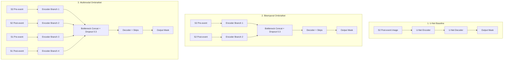

# OMBRIA & OmbriaNet: Detailed Project Documentation

This documentation provides an in-depth technical overview of the OMBRIA dataset, the preprocessing pipelines, model architectures, metrics, execution instructions, and answers to frequently asked questions about the project.

---

## 1. Core Concept & Motivation

### The Challenge of Flood Mapping
Accurate, real-time delineation of flooded areas is critical for ecological, economic, and humanitarian relief efforts. Traditional optical satellite mapping suffers from a major weakness: **intense precipitation events are almost always accompanied by heavy cloud cover**, rendering optical sensors blind.

### The OMBRIA Solution
OMBRIA solves this by using **Multimodal and Multitemporal Sensor Fusion**:
1. **Multimodal**: Combines optical sensors (Sentinel-2), which provide rich spectral signatures under clear skies, with Synthetic Aperture Radar (Sentinel-1), which penetrates cloud cover and operates day or night.
2. **Multitemporal**: Uses both **pre-event** and **post-event** imagery. This allows the model to perform change detection, distinguishing permanent water bodies (rivers, lakes, oceans) from newly flooded regions.

---

## 2. Dataset Structure (`OmbriaS1` & `OmbriaS2`)

The OMBRIA dataset contains co-registered, tile-aligned image patches derived from **23 major flood events** globally between 2017 and 2021. 

### Folder Layout
The dataset is split into two primary folders based on the satellite mission:
* **`OmbriaS1/`**: Sentinel-1 SAR (Synthetic Aperture Radar) data.
* **`OmbriaS2/`**: Sentinel-2 MSI (Multispectral Instrument) data.

Each folder contains standard subdivisions for training and validation:
```text
OmbriaS1/ (or OmbriaS2/)
└── train/ (and test/)
    ├── BEFORE/  -> Images of the region taken before the flood event
    ├── AFTER/   -> Images of the same region taken after the flood event
    └── MASK/    -> Binary ground-truth flood mask (1 = flooded, 0 = non-flooded)
```

### Spec Specifications

| Property | Sentinel-1 (`OmbriaS1`) | Sentinel-2 (`OmbriaS2`) |
| :--- | :--- | :--- |
| **Sensor Type** | Synthetic Aperture Radar (SAR) | Multispectral Instrument (MSI) |
| **Input Channels** | 1 Channel (VV Polarization) | 3 Channels (Band 3 Green, Band 8 NIR, Band 11 SWIR) |
| **Resolution** | 256 × 256 pixels | 256 × 256 pixels |
| **Spatial Resolution** | 10 meters / pixel | 10 meters (B3, B8), 20 meters (B11) |
| **Ground Truth** | Copernicus EMS rapid mapping vectors rasterized to binary masks |
| **Values Range** | 0 to 255 (divided by 255.0 to normalize to `[0, 1]`) |

---

## 3. Data Preprocessing & GEE Pipeline

Data preprocessing was originally conducted using Google Earth Engine (GEE). The logic is simulated locally in [gee_parser.py](file:///c:/Users/Zui/Downloads/OMBRIA-master/OMBRIA-master/gee_parser.py):

1. **Sentinel-1 GRD VV Processing**:
   * Acquired at Level-1 Ground Range Detected (GRD).
   * Geometrically corrected using the SRTM Digital Elevation Model.
   * **Speckle Filter**: A $30 \times 30$ meter spatial median filter is applied to reduce the characteristic noise ("speckle") inherent in radar signals.
2. **Sentinel-2 L2A Processing**:
   * Acquired at Level-2A bottom-of-atmosphere reflectance (orthorectified and atmospherically corrected).
   * Bands used: **Band 3 (Green)**, **Band 8 (Near-Infrared)**, and **Band 11 (Short-Wave Infrared)**.
3. **Temporal Windows**:
   * **Pre-event (`BEFORE`)**: Average intensity of clear-sky pixels (cloud cover $< 10\% - 30\%$) during the month of May of the year before the flood.
   * **Post-event (`AFTER`)**: First available cloud-screened image acquired within 15 days following the flood activation.
4. **Reprojection**: All images are reprojected using Universal Transverse Mercator (UTM) zones corresponding to the specific event coordinates.
5. **Data Augmentation**: Standard operations applied during training include left-right flips, horizontal/vertical shifts, shearing, and random rotations to enhance generalization.

---

## 4. Model Architectures

The repository implements three deep learning architectures in [models.py](file:///c:/Users/Zui/Downloads/OMBRIA-master/OMBRIA-master/models.py):



### 1. U-Net (Post-event Baseline)
* **Description**: A single-input architecture. It only accepts the post-event image of one modality.
* **Limitation**: It struggles to distinguish permanent water bodies (lakes, rivers) from temporary flood water.
* **Parameters**: 31,032,837

### 2. Bitemporal OmbriaNet
* **Description**: A two-branch encoder architecture. It accepts a pre-event and post-event image of the **same modality** (e.g., S2 before/after). The features are concatenated at the bottleneck before decoding.
* **Parameters**: 10,797,637

### 3. Multimodal OmbriaNet (Proposed Method)
* **Description**: A four-branch encoder architecture. It fuses **multimodal** (S1 + S2) and **bitemporal** (Pre + Post) data. It takes S2 pre-event, S2 post-event, S1 pre-event, and S1 post-event images, concatenates them at the bottleneck, regularizes using Dropout (0.3), and outputs the flood mask.
* **Parameters**: 18,108,101

---

## 5. Evaluation Metrics

Model performance is evaluated on a pixel-wise basis using three main metrics, implemented in [metrics.py](file:///c:/Users/Zui/Downloads/OMBRIA-master/OMBRIA-master/metrics.py):

* **Pixel Accuracy (PA)**: The ratio of correctly classified pixels (both flooded and dry land) to total pixels.
  $$\text{PA} = \frac{\text{TP} + \text{TN}}{\text{TP} + \text{TN} + \text{FP} + \text{FN}}$$
* **Intersection over Union (IoU / Jaccard Index)**: The key metric for segmentation. It measures the overlap between predicted flood pixels and the ground truth.
  $$\text{IoU} = \frac{\text{TP}}{\text{TP} + \text{FP} + \text{FN}}$$
* **Frequency Weighted IoU (FWIoU)**: An improvement over normal IoU that scales metrics based on the pixel frequency of each class to counter class imbalance.

---

## 6. Local & Kaggle Execution Guide

### Local Environment Setup
1. Clone the repository and install requirements:
   ```bash
   pip install -r requirements.txt
   ```
2. Run the checklist validation suite to verify the repository:
   ```bash
   python test_checklist.py
   ```

### Kaggle Execution (with GPU)
1. **Copy dataset folders** in the first cell of your Kaggle notebook so they are in `/kaggle/working`:
   ```python
   import os
   import shutil

   input_dir = "/kaggle/input/ombria-code-and-data" 

   # Copy scripts
   for file in os.listdir(input_dir):
       if file.endswith(".py") or file == "requirements.txt":
           shutil.copy(os.path.join(input_dir, file), "/kaggle/working/")

   # Copy datasets
   if not os.path.exists("/kaggle/working/OmbriaS1"):
       shutil.copytree(os.path.join(input_dir, "OmbriaS1"), "/kaggle/working/OmbriaS1")
   if not os.path.exists("/kaggle/working/OmbriaS2"):
       shutil.copytree(os.path.join(input_dir, "OmbriaS2"), "/kaggle/working/OmbriaS2")
   ```
2. **Execute Training**:
   ```bash
   !python main.py --mode train --model multimodal --epochs 50 --batch_size 8 --data_dir_s1 OmbriaS1 --data_dir_s2 OmbriaS2
   ```
3. **Evaluate Checkpoint**:
   ```bash
   !python main.py --mode evaluate --model multimodal --checkpoint best_model.pth --data_dir_s1 OmbriaS1 --data_dir_s2 OmbriaS2
   ```

---

## 7. Performance Benchmarks

Retrained benchmark scores on the standard 90/10 split, compared with paper tables:

| Method | Modality | Pixel Accuracy (PA) | Mean IoU | FW IoU |
| :--- | :--- | :--- | :--- | :--- |
| **Otsu Thresholding** | Sentinel-2 (MNDWI) | 0.7930 | 0.3330 | 0.6889 |
| **Multimodal SVM** | S1 & S2 | 0.8504 | 0.6245 | 0.7631 |
| **U-Net** | Sentinel-1 | 0.7925 | 0.5734 | 0.6971 |
| **U-Net** | Sentinel-2 | 0.8251 | 0.5418 | 0.7221 |
| **Bitemporal OmbriaNet** | Sentinel-1 | 0.7203 | 0.5181 | 0.6229 |
| **Bitemporal OmbriaNet** | Sentinel-2 | 0.8733 | 0.6457 | 0.7919 |
| **Multimodal OmbriaNet** | **S1 & S2 (Fused)** | **0.9010** | **0.7236** | **0.8330** |

---

## 8. Frequently Asked Questions (FAQ)

#### Q: Why are the validation predictions (white pixels) not a 100% match to the ground truth?
**A**: This is expected for several reasons:
1. **Resolution Constraints**: Sentinel-1 SAR is low-resolution and noisy, making sharp borders difficult to resolve.
2. **Ground Truth Quality**: The Copernicus EMS vectors are made rapidly during disasters by human annotators, which means they can omit flooded areas or slightly misalign details. 
3. **Training Duration**: Model checkpoints from early epochs (e.g. Epoch 15) contain minor false positives that get cleaned up as training continues to Epoch 50.

#### Q: How does the model perform so well in cloudy areas?
**A**: Sentinel-2 (optical) cannot see through clouds, and will show useless visual features. However, the Multimodal model also inputs Sentinel-1 (SAR) which uses C-band radar signals. These signals easily pass through clouds and bounce off the water surface (which acts as a specular reflector, appearing dark/specular in radar amplitudes). The model fuses these two features together, bypassing cloud interference.

#### Q: What do black and white pixels mean in the predictions?
* **White (value `1` / True)**: Flooded area.
* **Black (value `0` / False)**: Dry land / Non-flooded area.
